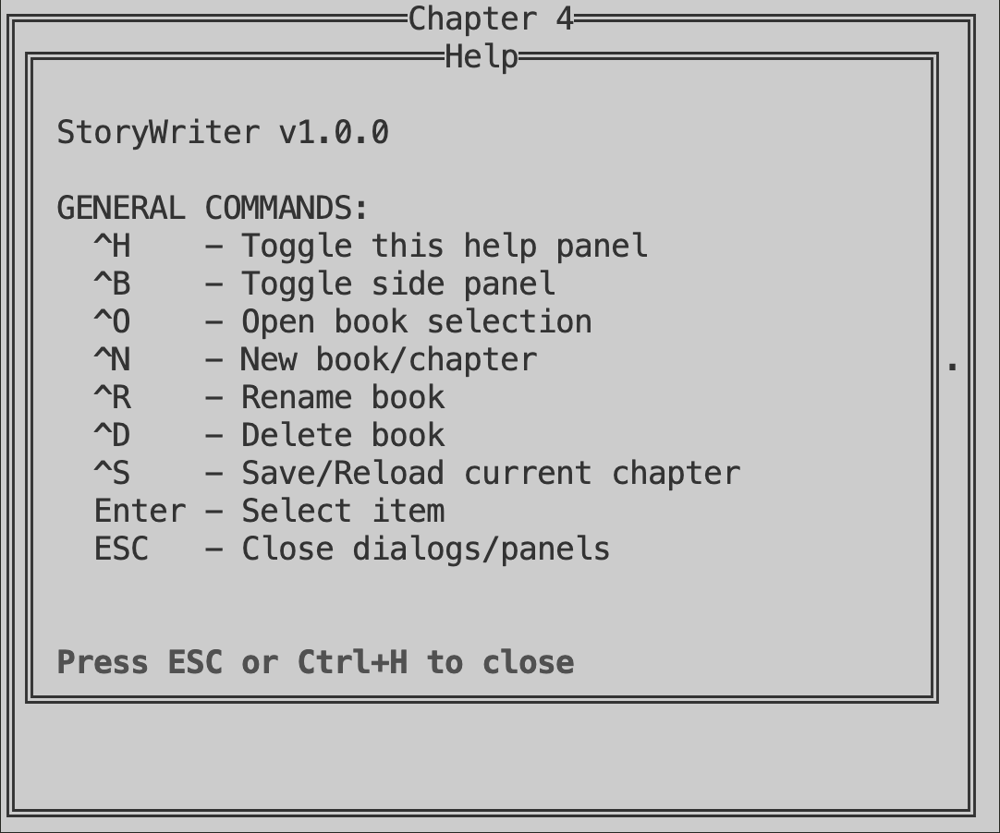

# PicoWriter v1.0.1

A minimalist terminal-based story writing application designed for distraction-free creative writing.




## Features

- **Distraction-free writing**: Clean terminal interface with no distractions
- **Book & Chapter management**: Organize your stories with books and chapters
- **Auto-capitalization**: Smart capitalization for sentences and standalone "I"
- **Local storage**: All your work is saved locally in the `data/` folder
- **Keyboard shortcuts**: Efficient navigation with intuitive key combinations
- **Built-in help**: Comprehensive user manual included with the app

## Installation

### System Installation (Recommended)

For system-wide installation on Linux systems (including Picocalc):

```bash
# Run as root or with sudo
sudo ./install.sh
```

This will:
- Install PicoWriter to `/opt/picowriter`
- Create a launcher script at `/root/command-launcher/picowriter.sh`
- Make PicoWriter available system-wide as `picowriter`

After installation, you can launch PicoWriter simply by typing:
```bash
picowriter
```

### Manual Installation

1. Clone this repository
2. Ensure you have Python 3 installed
3. Run the application:
   ```bash
   python3 main.py
   ```

### Uninstallation

To remove PicoWriter from your system:
```bash
sudo ./uninstall.sh
```

## Quick Start

1. **Create a book**: Press `Ctrl+O` → `Ctrl+N` → Enter book name
2. **Create chapters**: Press `Ctrl+N` → Enter chapter name
3. **Start writing**: Select a chapter and begin writing
4. **Save your work**: Press `Ctrl+S` to save changes
5. **Get help**: Press `Ctrl+H` for the help panel

## Keyboard Shortcuts

- `Ctrl+B` - Toggle side panel
- `Ctrl+O` - Open book selection
- `Ctrl+N` - New book/chapter
- `Ctrl+R` - Rename book/chapter
- `Ctrl+D` - Delete book/chapter
- `Ctrl+S` - Save/Reload current chapter
- `Ctrl+H` - Show help panel
- `Esc` - Close dialogs/panels

## File Organization

Your stories are organized as:
```
data/
├── .data              # Recent books list
├── Your Book Name/    # Book folder
│   ├── .chapter_order # Chapter order
│   ├── Chapter1.md    # Your chapters
│   └── Chapter2.md
└── Another Book/
```

## Requirements

- Python 3.6+
- Terminal with ANSI escape code support

## Version

**Current Version**: v1.0.1

This is the initial stable release featuring core writing functionality, book management, and auto-capitalization.

## License

This project is open source. Feel free to use, modify, and distribute.

---

Happy writing with PicoWriter! 📝